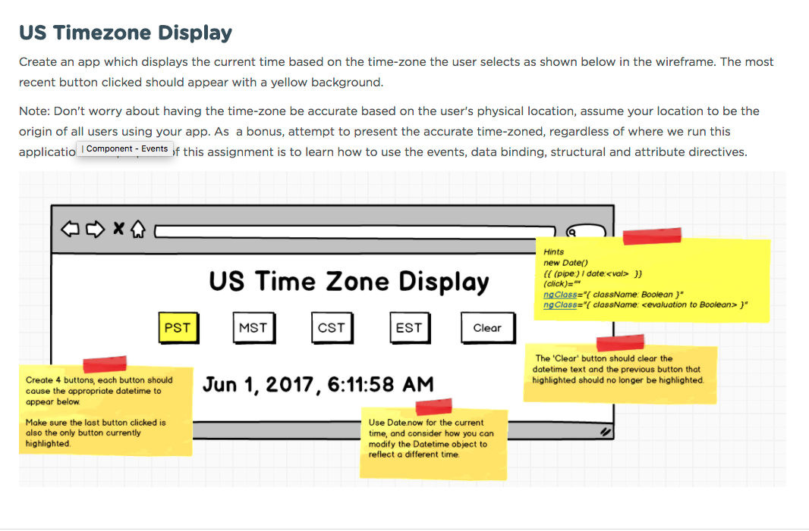

US Timezone Display
Create an app which displays the current time based on the time-zone the user selects as shown below in the wireframe. The most recent button clicked should appear with a yellow background.

Note: Don't worry about having the time-zone be accurate based on the user's physical location, assume your location to be the origin of all users using your app. As  a bonus, attempt to present the accurate time-zoned, regardless of where we run this application. This purpose of this assignment is to learn how to use the events, data binding, structural and attribute directives.

# UsTimezone

This project was generated with [Angular CLI](https://github.com/angular/angular-cli) version 1.2.1.

## Development server

Run `ng serve` for a dev server. Navigate to `http://localhost:4200/`. The app will automatically reload if you change any of the source files.

## Code scaffolding

Run `ng generate component component-name` to generate a new component. You can also use `ng generate directive|pipe|service|class|module`.

## Build

Run `ng build` to build the project. The build artifacts will be stored in the `dist/` directory. Use the `-prod` flag for a production build.

## Running unit tests

Run `ng test` to execute the unit tests via [Karma](https://karma-runner.github.io).

## Running end-to-end tests

Run `ng e2e` to execute the end-to-end tests via [Protractor](http://www.protractortest.org/).
Before running the tests make sure you are serving the app via `ng serve`.

## Further help

To get more help on the Angular CLI use `ng help` or go check out the [Angular CLI README](https://github.com/angular/angular-cli/blob/master/README.md).
# MEAN_AGULAR_US-Timezone
